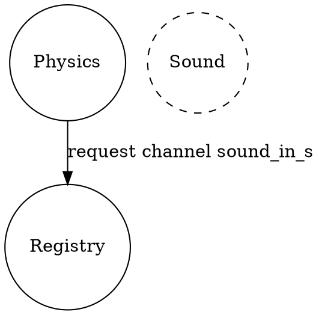
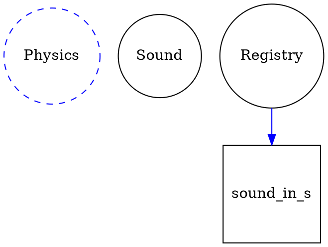
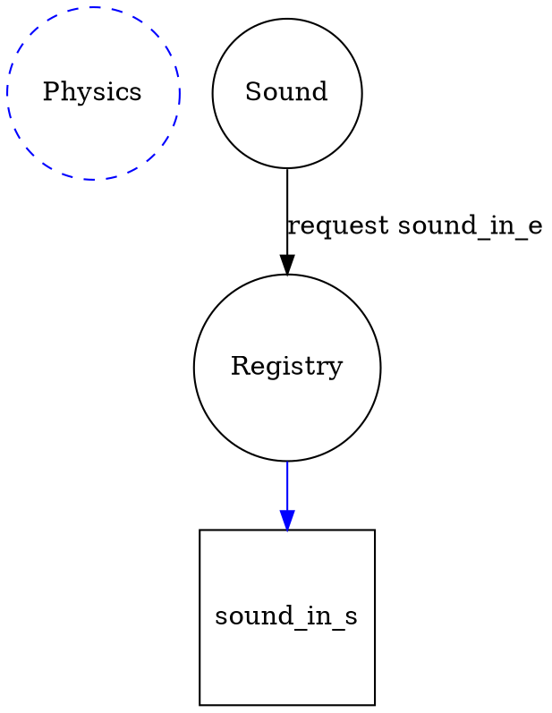
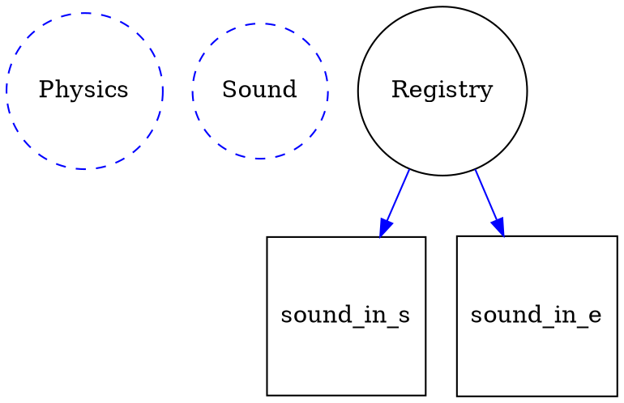
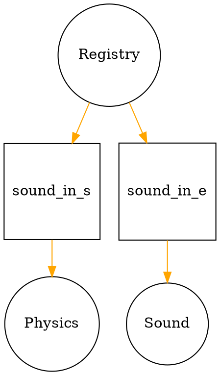
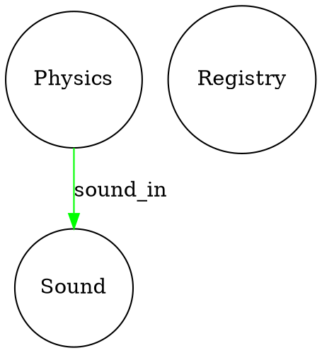

# Today
So I need to work out these channels.
There's a few things to consider.
- Does an actor need to wait till another actor exists to recv a message
- If not then does the message get buffered? 
- If so how deep, just 1? or n?

So the idea is to have a store of requests and only send a response when the 
sender is online.
What about when a sender comes online with no receiver?
I think that's ok because there will be back pressure unless we use a watch.
The only problem with watch is it needs an inital value.
For inbound mpsc makes sense but wasn't there an issue with creating the channel?
The receiver can't be cloned so needs to be moved out of the hashmap once the channel is established.
Basically once the request has a response.
The start can stay because it can be cloned.

Only Physics online

Sound comes online and physics is awaiting request

Now sound needs a way to get sound_i_e

Registry has full request, both actors awaiting

Sends back request answers

Now channel is online
